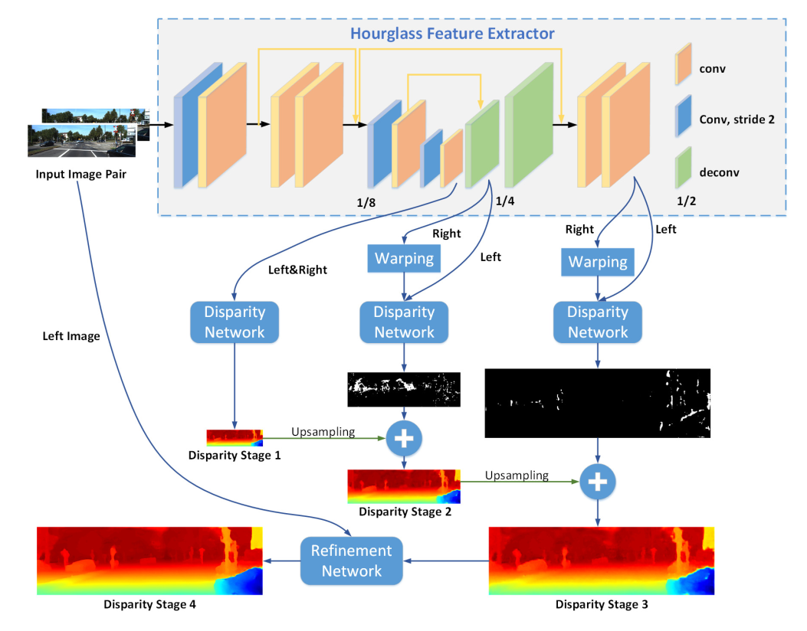

# An End-To-End Light-Weighted Muilt-Stage Stereo Matching Network(飞浆/PaddlePaddle Version)  

This repository is the code(PaddlePaddle version) of Our works **LWSNet** in C4-AI Match for Team Stereo Free(双目纵横)


## Contents

1. [Introduction](#Introduction)
2. [Requirements](#Requirements)
3. [Usage](#Usage)


### 1. Introduction

Deep-learning-based stereo matching methods have achieved significant improvement over traditional methods and obtained great successes in recent years. However, how to trade off accuracy and speed and predict accurate disparity in real time has been a long-standing problem in the stereo matching area. We present an end-to-end light-weight convolutional neural network (CNN) to quickly estimate accurate disparity maps. Our proposed model is based on AnyNet, a real-time network which generates disparity in stages to achieve anytime prediction. Hourglass architecture with dilated convolutional layers is exploited to extract richer features of input stereo images. We also introduce residual connections in 2D CNN and 3D CNN to avoid information loss. Besides, we adopt a color guidance refinement to improve disparity performance. Depthwise separable convolution is used to replace standard convolution in color guidance refinement to sharply decrease the number of parameters and computational complexity. We refer to our proposed model as Light Weight Stereo Network (LWSN). LWSN is trained and evaluated on three well-known stereo datasets. Experiments indicate that our model is effective and efficient.

<center> LWSNet Structure </center>  




### 2. Requirements  

Our System version is Ubuntu20.04 with Graphics card Titan Xp.  

#### Enviroment Dependencies:  
- Anaconda or Miniconda
- Python3 or Later
- PaddlePaddle 2.0rc(GPU Version)
- OpenCV 4.0 or Later 

We provided [paddle_env.yml](paddle_env.yml) to install neccesarry dependencies directly throught conda.
```
conda env create -f paddle_env.yml
```
Or install manually
```
1. conda create --name paddle
2. conda install -n paddle paddlepaddle-gpu==2.0.0rc0 cudatoolkit=10.2 
3. conda install -n paddle opencv
```
#### Dataset:
- [KITTI2015(Finetune)](http://www.cvlibs.net/datasets/kitti/eval_scene_flow.php?benchmark=stereo)
- [Sceneflow(Pre-Train)](https://lmb.informatik.uni-freiburg.de/resources/datasets/SceneFlowDatasets.en.html)

### 3. Usage  


#### For Train and Finetune:
