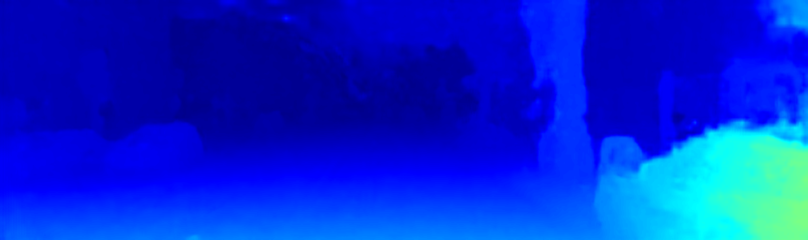
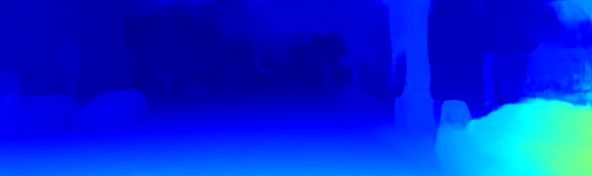

# An End-To-End Light-Weight Muilt-Stage Stereo Matching Network[飞浆/PaddlePaddle Version]

This repository is the code(PaddlePaddle version) of Our works **LWSNet** in C4-AI Match for Team Stereo Free(双目纵横)


## Contents

1. [Introduction](#Introduction)
2. [Requirements](#Requirements)
3. [Usage](#Usage)
4. [Results](#Results)

### 1. Introduction

Deep-learning-based stereo matching methods have achieved significant improvement over traditional 
methods and obtained great successes in recent years. 
However, how to trade off accuracy and speed and predict accurate disparity 
in real time has been a long-standing problem in the stereo matching area. 
We present an end-to-end light-weight convolutional neural network (CNN) to quickly 
estimate accurate disparity maps. Our proposed model is based on AnyNet, 
a real-time network which generates disparity in stages to achieve anytime prediction. 
Hourglass architecture with dilated convolutional layers is exploited to extract richer
features of input stereo images. We also introduce residual connections in 2D CNN and
3D CNN to avoid information loss. Besides, we adopt a color guidance refinement to 
improve disparity performance. Depthwise separable convolution is used to replace
standard convolution in color guidance refinement to sharply decrease the number 
of parameters and computational complexity. 
We refer to our proposed model as Light Weight Stereo Network (LWSN). 
LWSN is trained and evaluated on well-known stereo datasets. 
Experiments indicate that our model is effective and efficient.


<p align="center">LWSNet Structure</p>

### 2. Requirements  

Our System version is Ubuntu20.04 with Graphics card **Titan Xp** during training and testing.  

#### Enviroment Dependencies:  
- Anaconda or Miniconda
- Python3 or Later
- PaddlePaddle 2.0rc(GPU Version)
- OpenCV 4.0 or Later 

We provided [paddle_env.yml](paddle_env.yml) to install necesary dependencies directly throught conda.
```
conda env create -f paddle_env.yml
```
Or install manually
```
1. conda create --name paddle
2. conda install -n paddle paddlepaddle-gpu==2.0.0rc0 cudatoolkit=10.2 
3. conda install -n paddle opencv
4. conda activate paddle
```
#### Dataset:
- [KITTI2015(Finetune)](http://www.cvlibs.net/datasets/kitti/eval_scene_flow.php?benchmark=stereo)
- [Sceneflow(Pre-Train)](https://lmb.informatik.uni-freiburg.de/resources/datasets/SceneFlowDatasets.en.html)

### 3. Usage  

#### Prepare the dataset:

We provide the kitti2015 dataset(1.9GB) in our attachment.  
But we do not provide the sceneflow dataset because it is too large(almost 207GB).

```
mkdir dataset
cd $CURRENT_DIR
mv $KITTI2015 ./dataset/
mv $SCENEFLOW ./dataset/
```
Then the directory structure of dataset is as follows:

>dataset  
└── kitti2015  
│   ├── testing  
│   └── training  
└── sceneflow  
│   ├── driving__disparity  
│   ├── driving__frames_cleanpass  
│   ├── frames_cleanpass  
│   ├── frames_disparity  
│   ├── monkaa__disparity  
│   └── monkaa__frames_cleanpass  


#### For Train, Finetune and Inference:

**Default train** command(in our 1 Tintan Xp it would spend almost 18 hours with default parameters):
```
python train.py
```

The default dataset path is `dataset/sceneflow/`, epoch is `10`, learn rate is `5e-4`
You can also specfic them by appending `--datapath`, `--epoch` and `--lr`.

The results will be defaultly saved in directory `result/pretrained`.

**Default finetune**(in our one Tintan Xp it would spend almost 2.8 hours with default parameters):
```
python finetune.py
```

The default dataset path is `dataset/kitti2015/training/`, epoch is `300`, learning rate is `5e-4`
You can also specfic them by appending `--datapath`, `--epoch` and `--lr`.

The results will be defaultly saved in directory `result/finetune`.

```
python inference.py
```

The default image path is `dataset/kitti2015/testing/`, You can also specify them using `--img_path`.  
The results(colored disparity images) will be defaultly saved in directory `result/inference`.

**${train, finetune, inference}.py** also output the log file in directory `log`.

##### We also provide one pair of stereo images under directory `reference/${left\right}_test.png` from KITTI2015 Dataset for testing conveniently.

##### Our well-trained models are available now! You can download and use them to test directly!
- [Our Finetuned Model](https://drive.google.com/drive/folders/1S90XaZ0GG_Go__7M95MpttlgdwHe4Nxu?usp=sharing)
- [Our Pretrained Model](https://drive.google.com/drive/folders/1xc92Obm5PrFo0lBXzd9dWf3nLAkwelLS?usp=sharing)

With above model files and test images, you can test by command:
```
python inference.py --left_img reference/left_test.png
```
The result are saved in `reference/${1,2,3,4}.png` corresponding to the inference result of stages


### 4. Results

Our model pretrained 10 epoches on Sceneflow dataset and finetued 300 epochs on Kitti2015.  
Finally get the **2.87%** 3-pixel error on Kitti2015 validation set.
Our model can keep the speed 10FPS with all 4 stages during inference.

<p align="center">Raw left image</p>


<p align="center">Stage 1</p>


<p align="center">Stage 2</p>


<p align="center">Stage 3</p>



<p align="center">Stage 4</p>



  
